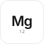
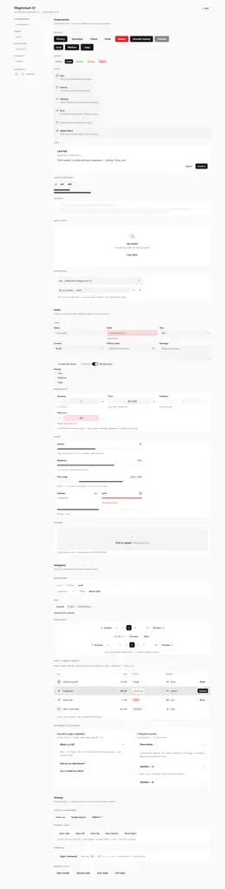

<div align="center">



# Magnesium UI

**My React UI kit — the one I actually use.**<br/>
CSS Modules + tokens. Light/dark. No Tailwind, no runtime. Zinc, 60fps.

[](https://www.npmjs.com/package/@m4nst3in/magnesium-ui)
[](#)
[](LICENSE)

[Install](#install) · [Usage](#usage) · [Components](#components) · [Theming](#theming)

</div>

<div align="center">
  
  <p><sub>Playground at <code>npm run dev</code> — 31 components, same code that ships</sub></p>
</div>

I was tired of copying Button styles between projects. So I made one kit, used it everywhere, and kept it tiny.

---

### Install

```bash
npm i @m4nst3in/magnesium-ui
```

```tsx
import { Button, ToastProvider } from '@m4nst3in/magnesium-ui'
import '@m4nst3in/magnesium-ui/styles.css'

export function App() {
  return (
    <ToastProvider>
      <Button onClick={() => toast({ title: 'Saved' })}>Save</Button>
    </ToastProvider>
  )
}
```

No publish for local: `npm i file:../magnesium-ui`.

---

### Components

|  |  |
|---|---|
| **Fundamentals** | `Button` `Badge` `Card` `Alert` `Avatar` `Skeleton` `EmptyState` `CopyButton` |
| **Forms** | `Input` `Textarea` `Select` `Combobox` `DatePicker` `Checkbox` `RadioGroup` `Switch` `NumberField` `Slider` `FileDrop` |
| **Navigation** | `Breadcrumb` `Tabs` `Pagination` `Table` `Accordion` `Collapsible` |
| **Overlays** | `Modal` `Drawer` `Tooltip` `Dropdown` `Command` `Toast` |

Each is `tsx + module.css`. No ` #fff ` — only `var(--ui-*)`.

---

### Theming

```ts
document.documentElement.dataset.theme = 'dark'
```

```css
:root { --ui-primary: rebeccapurple; }
```

All tokens in `src/styles/tokens.css`.

---

### Develop

```bash
npm run dev        # playground — 4 categories, sidebar
npm run check      # biome format + lint + imports
npm run build      # dist/magnesium-ui.css + types
```

Add one:

```
src/components/MyComp/MyComp.tsx + MyComp.module.css
→ cn() + tokens
→ export in src/index.ts
→ demo in src/demo/sections/
```

---

### Why Magnesium?

Mg 12 — lightweight metal, like zinc. Same vibe as the palette. And `magnesium-ui` was free on npm.

